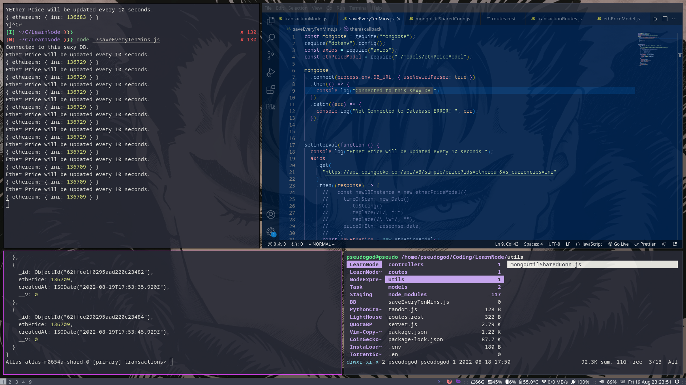
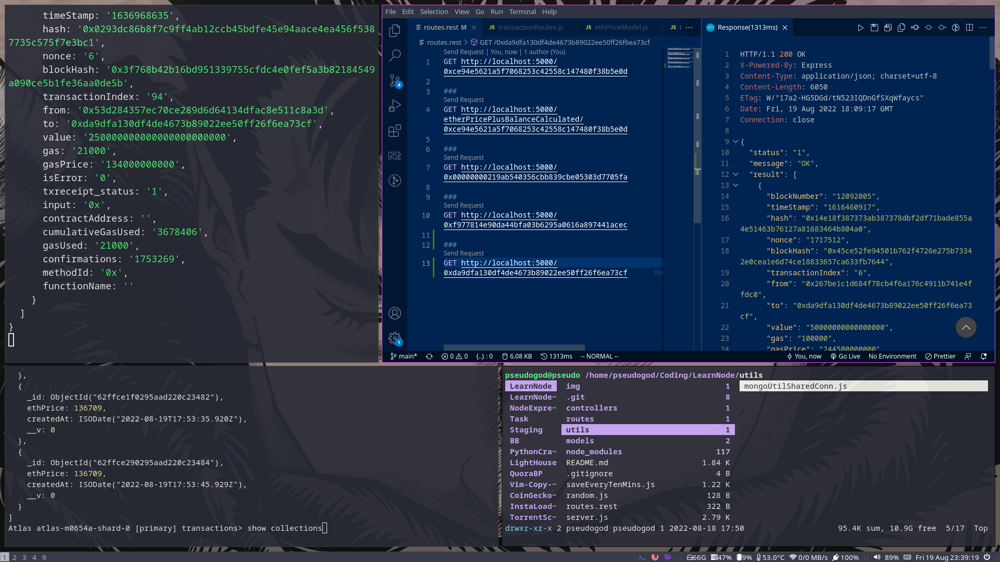
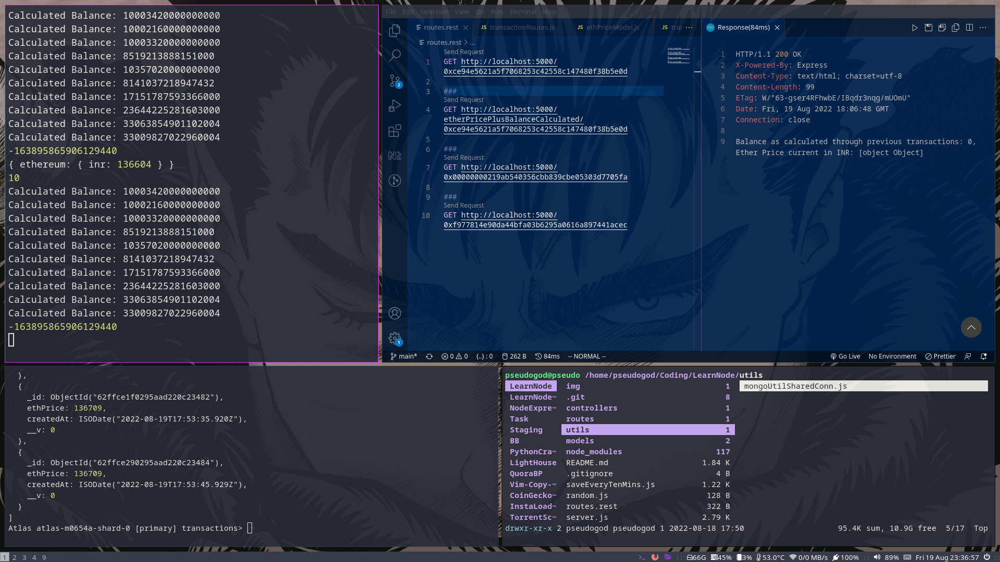
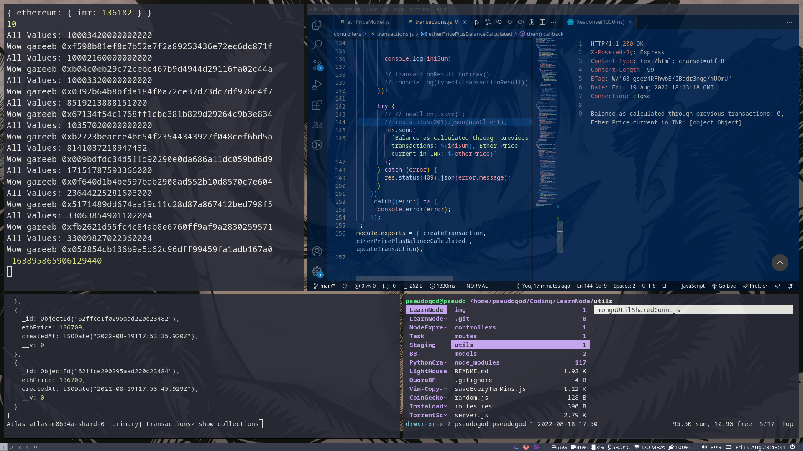

# Server Side Application to fetch Crypto Transactions of a user

Wow, this was very fun. Code has been commented upon thoroughly for better understanding. 
## Description

All tasks have been completed. The result of the third task will never return the actual balance of the wallet as the DB only stores unique wallet address. I have set the walletAddress as the _id itself and handled all exceptions.

And forEach Wallet Address ---> Only 10 transactions are listed.

### Dependencies

Create a .env in the root folder file and add: DB_URL="your_desired_url", API_KEY="your_api_key" , PORT=5000

Install all the dependencies and run with the following command, devStart uses nodemon to autorefresh.
```
    git clone https://github.com/pseudog0d/Ethereum-Wallet-API.git
    cd Assignment-API
    npm i && npm run devStart
```
### Executing program

- To run the script for updating the price of Eth every 10 minutes (I have configure it to show results every 10 seconds) just run:
```
    node saveEveryTenMins.js
```


The DB will get populated as the script is run, you can refer the timestamps in the screenshot to see that the results are being updated as the script is run every 10 seconds.


- To run the main API just execute:

```
    npm run devStart        
```

Hit the API through POSTMAN, or any tool of your choice, you can always use the route.rest file in VS code with the extension: REST Client and execute it here itself.

Task 1:






Attaching all the SS for your reference:

Task 3: 





